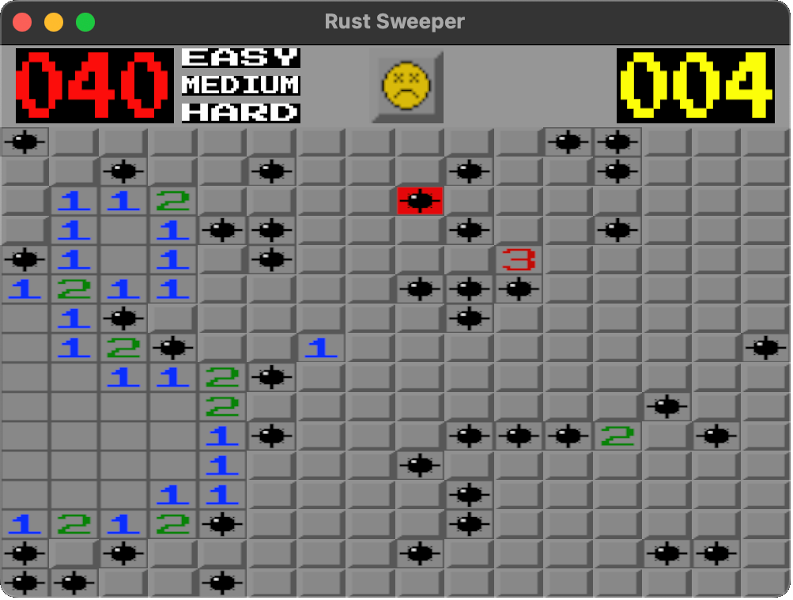
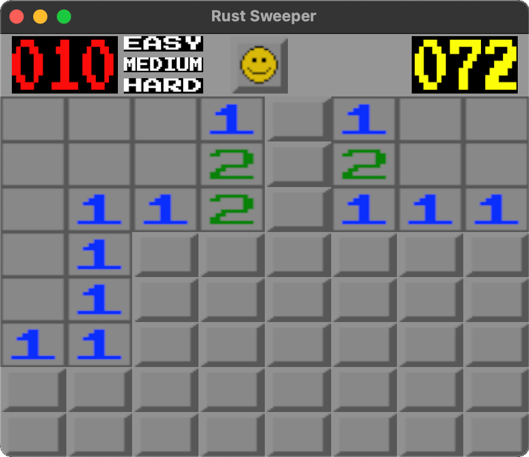

# Rust Sweeper

Simple implementation of a popular game, minesweeper. Written in rust.

### Dependencies

Rustc, Cargo

### Installing

```sh
cargo build --release
cd target/release && rust_sweeper
```
## License

This project is licensed under the MIT License - see the LICENSE.md file for details

## Acknowledgments

Inspiration, code snippets, etc.
* [readme template used](https://gist.github.com/DomPizzie/7a5ff55ffa9081f2de27c315f5018afc)
* [font used for timer and bomb counter](https://fonts.google.com/specimen/Press+Start+2P)


## Screnshots

|                 |                 |
| --------------------------------------- | --------------------------------------- |
